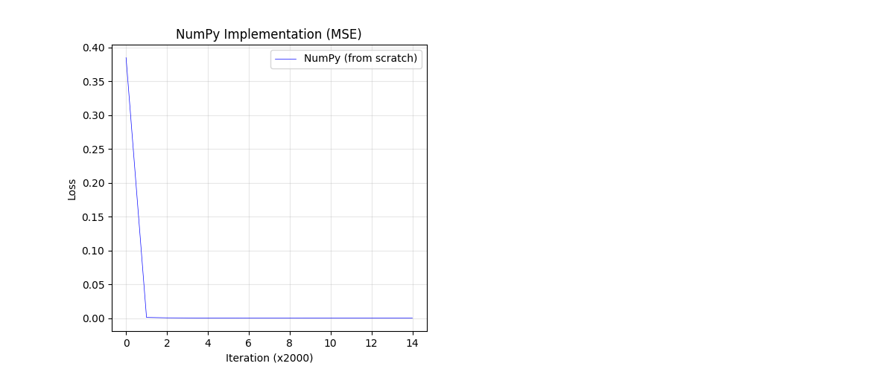
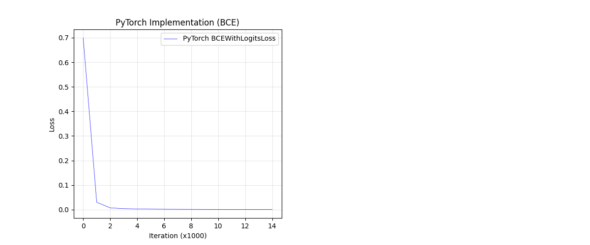
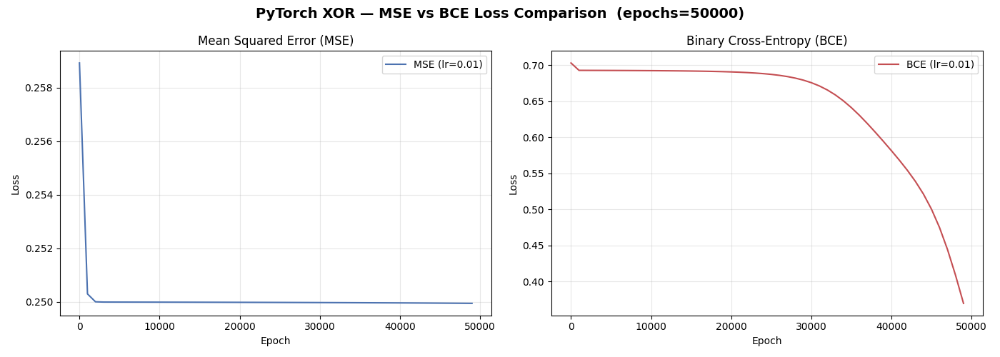
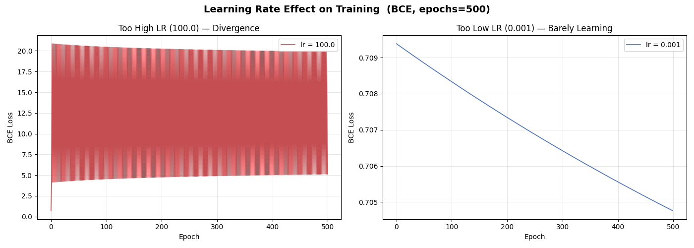

# XOR Neural Network — From Scratch

> A pedagogical deep learning project implementing an XOR-solving neural network in raw NumPy and PyTorch, with experiments exploring loss functions and learning rate dynamics.

---

## Table of Contents
1. [Problem Description](#problem-description)
2. [Motivation](#motivation)
3. [Project Structure](#project-structure)
4. [Model Architecture](#model-architecture)
5. [Backpropagation — Core Math](#backpropagation--core-math)
6. [Implementation](#implementation)
7. [Experiments & Results](#experiments--results)
   - [NumPy MSE Training](#1-numpy-mse-training)
   - [PyTorch BCE Training](#2-pytorch-bce-training)
   - [Loss Function Comparison: MSE vs BCE](#3-loss-function-comparison-mse-vs-bce)
   - [Learning Rate Effect](#4-learning-rate-effect)
8. [Key Insights](#key-insights)
9. [Running the Experiments](#running-the-experiments)
10. [Requirements](#requirements)
11. [Appendix: Full Mathematical Derivation](#appendix-full-mathematical-derivation)

---

## Problem Description

The **XOR (exclusive OR)** function is a classic non-linearly separable binary classification problem. Given two binary inputs, the output is 1 only when the inputs differ:

| Input A | Input B | XOR Output |
|:-------:|:-------:|:----------:|
| 0 | 0 | 0 |
| 0 | 1 | 1 |
| 1 | 0 | 1 |
| 1 | 1 | 0 |

No single straight line can separate the positive class `{(0,1), (1,0)}` from the negative class `{(0,0), (1,1)}` in 2D space. This makes XOR the canonical benchmark for demonstrating that a neural network with at least one hidden layer can learn non-linear decision boundaries — something a simple perceptron cannot.

---

## Motivation

This project serves two purposes:

1. **Pedagogical** — Build a complete neural network from first principles using only NumPy, with every forward pass, loss computation, and gradient manually coded. This makes the internals of deep learning transparent, as opposed to using a framework that abstracts them away.

2. **Comparative** — Implement the same model in PyTorch to contrast framework-level abstractions (autograd, `nn.Module`, optimizers) against manual implementations. Run controlled experiments on loss functions (MSE vs BCE) and learning rate dynamics to demonstrate their theoretical properties empirically.

---

## Project Structure

```
xor-nn-from-scratch/
│
├── numpy_xor/
│   ├── model.py              # XORModel class: forward(), backward(), train()
├── pytorch_xor/
│   └── model.py              # XORNet (nn.Module): 2→2→1, raw logit output
│
├── experiments/
│   ├── numpy_training.py     # NumPy model, MSE → plots/numpy_mse_loss.png
│   ├── pytorch_training.py   # PyTorch model, BCE → plots/pytorch_mse_loss.png
│   ├── loss_comparison.py    # PyTorch MSE vs BCE → plots/loss_comparison.png
│   └── learning_rate.py      # LR effect (lr=100 vs lr=0.001) → plots/lr_effect.png
│
├── plots/
│   ├── numpy_mse_loss.png
│   ├── pytorch_mse_loss.png
│   ├── loss_comparison.png
│   └── lr_effect.png
│
└── README.md
```

---

## Model Architecture

Both implementations share the same architecture: a fully connected feedforward network with one hidden layer.

```
Input Layer       Hidden Layer        Output Layer
  (2 units)  →   (2 units, σ)   →    (1 unit, σ)
```

- **Input:** 2 features (the two XOR bits)
- **Hidden layer:** 2 neurons with sigmoid activation
- **Output layer:** 1 neuron — sigmoid activation (NumPy) or raw logit (PyTorch with `BCEWithLogitsLoss`)
- **Parameters:** W1 (2×2), b1 (1×2), W2 (2×1), b2 (1×1) = **9 trainable parameters total**

The use of sigmoid activations introduces non-linearity, allowing the network to carve out a non-linear decision boundary in input space — the minimum requirement to solve XOR.

---

## Backpropagation — Core Math

Training uses **gradient descent** with **backpropagation** (chain rule applied layer-by-layer in reverse).

### Forward Pass

```math
Z^{[1]} = X W^{[1]} + b^{[1]}
```
```math
A^{[1]} = \sigma(Z^{[1]})
```
```math
Z^{[2]} = A^{[1]} W^{[2]} + b^{[2]}
```
```math
\hat{y} = \sigma(Z^{[2]})
```

where $\sigma(z) = \frac{1}{1 + e^{-z}}$ and its derivative is $\sigma'(z) = \sigma(z)(1 - \sigma(z))$.

### Loss Functions

**Mean Squared Error (MSE):**
```math
\mathcal{L}_{MSE} = \frac{1}{m}\sum_{i=1}^{m}(y_i - \hat{y}_i)^2
```

**Binary Cross-Entropy (BCE):**
```math
\mathcal{L}_{BCE} = -\frac{1}{m}\sum_{i=1}^{m}\left[y_i \log(\hat{y}_i) + (1-y_i)\log(1-\hat{y}_i)\right]
```

### Output Layer Gradients

The critical difference between the two loss functions is visible in the output-layer gradient.

**With MSE:**
```math
\frac{\partial \mathcal{L}}{\partial Z^{[2]}} = \frac{2}{m}(\hat{y} - y) \cdot \sigma'(Z^{[2]}) = \frac{2}{m}(\hat{y} - y) \cdot \hat{y}(1-\hat{y})
```

**With BCE:**
```math
\frac{\partial \mathcal{L}}{\partial Z^{[2]}} = \frac{1}{m}(\hat{y} - y)
```

The sigmoid derivative $\hat{y}(1-\hat{y})$ cancels analytically in the BCE case, yielding a clean error signal. In the MSE case, this term multiplies the gradient and approaches zero whenever $\hat{y}$ saturates toward 0 or 1—the root cause of the **vanishing gradient problem** in MSE-trained sigmoid networks.

### Weight Updates (Gradient Descent)

```math
W^{[2]} \leftarrow W^{[2]} - \alpha \cdot (A^{[1]})^\top \delta^{[2]}
```
```math
W^{[1]} \leftarrow W^{[1]} - \alpha \cdot X^\top \delta^{[1]}
```

where $\alpha$ is the learning rate and $\delta^{[\ell]}$ denotes the layer-$\ell$ error term.

---

## Implementation

### NumPy (`numpy_xor/model.py`)

The `XORModel` class holds weights as plain NumPy arrays and exposes three methods:

```python
model = XORModel(seed=45)

# Single step
y_hat = model.forward(X)           # forward pass
model.backward(y, lr=4.0, loss_fn="mse")  # backprop + weight update

# Or full training loop
history = model.train(X, y, lr=4.0, epochs=30000, loss_fn="mse")  # or "bce"
```

Every matrix operation, sigmoid call, and gradient computation is written explicitly. There is no automatic differentiation.

### PyTorch (`pytorch_xor/model.py`)

```python
class XORNet(nn.Module):
    def __init__(self):
        super().__init__()
        self.hidden = nn.Linear(2, 2)
        self.output = nn.Linear(2, 1)   # outputs raw logits

    def forward(self, x):
        x = torch.sigmoid(self.hidden(x))
        return self.output(x)
```

Training uses `nn.BCEWithLogitsLoss()` (numerically stable, fuses sigmoid + BCE) and `optim.SGD`. Backpropagation is handled entirely by PyTorch's autograd engine — no gradients are manually coded.

---

## Experiments & Results

All experiments use the same 4-sample XOR dataset and SGD optimizer. Seeds are fixed for reproducibility.

### 1. NumPy MSE Training

**Setup:** `lr=4.0`, `epochs=30000`, MSE loss, manual backprop.



**Result:** The network converges to near-zero MSE loss within the first ~2000 iterations and achieves perfect classification on all four XOR inputs (all predictions correctly rounded to 0 or 1). This confirms the manual implementation of forward pass and backpropagation is mathematically correct.

---

### 2. PyTorch BCE Training

**Setup:** `lr=2.0`, `epochs=10000`, `BCEWithLogitsLoss`, PyTorch autograd.



**Result:** The PyTorch model achieves similarly rapid convergence, with BCE loss dropping sharply within the first ~1000–2000 epochs. The model correctly classifies all XOR inputs. The slightly different curve shape compared to MSE reflects the different loss scale (BCE is unbounded above; MSE is bounded at 0.25 for binary problems).

---

### 3. Loss Function Comparison: MSE vs BCE

**Setup:** Same PyTorch `XORNet`, `lr=0.01` for both, `epochs=50000`. Learning rate intentionally kept low to expose gradient quality differences.



**Result and Analysis:**

This experiment directly demonstrates the **vanishing gradient problem** in MSE-trained sigmoid networks.

- **MSE (left):** Loss drops from ~0.259 to ~0.250 in the first few hundred epochs, then becomes completely flat for the remaining ~49,500 epochs. A final loss of `0.2499` is approximately the theoretical maximum MSE for a binary problem where $\hat{y} \approx 0.5$ — indicating the model has learned nothing meaningful and is producing near-uniform predictions.

- **BCE (right):** Loss plateaus near `0.693` (i.e., $\ln 2$, the value when $\hat{y} = 0.5$) for the first ~25,000 epochs, then begins a sustained, accelerating descent, reaching `0.369` by epoch 50,000 and clearly still converging.

**Cause:** The MSE output gradient $\frac{\partial \mathcal{L}}{\partial Z^{[2]}} = \frac{2}{m}(\hat{y}-y)\cdot\hat{y}(1-\hat{y})$ is damped by the sigmoid derivative term $\hat{y}(1-\hat{y}) \approx 0.25$ at initialisation, and approaches zero as sigmoid saturates. At `lr=0.01`, this dampening is sufficient to stall training entirely. The BCE gradient $\frac{1}{m}(\hat{y}-y)$ has no such dampening — it maintains a gradient signal proportional purely to the prediction error, allowing sustained learning at the same learning rate.

> **Under identical hyperparameters and architecture, BCE converges while MSE stalls — a direct consequence of vanishing gradients induced by MSE's sigmoid derivative term.**

---

### 4. Learning Rate Effect

**Setup:** PyTorch `XORNet`, `BCEWithLogitsLoss`, `epochs=500`. Two extreme learning rates compared: `lr=100` and `lr=0.001`.



**Result:**

- **Too high (`lr=100`, left):** The loss spikes to ~20 within the first few epochs and then oscillates violently between ~4 and ~20 for all 500 epochs — never converging. Each gradient step massively overshoots the loss minimum, sending weights to the opposite extreme and producing an unstable feedback loop. The model never learns XOR.

- **Too low (`lr=0.001`, right):** The loss curve is a near-perfect straight line, decreasing linearly from `0.709` to `0.705` over 500 epochs. While stable, the change is so small that meaningful convergence would require tens of thousands more epochs at this rate.

**Insight:** The learning rate controls the trade-off between stability and speed. Too high — the optimizer overshoots; too low — it takes impractically long to converge. In practice, a well-tuned learning rate (e.g., `0.1`–`2.0` for this problem with SGD) produces rapid, stable convergence.

---

## Key Insights

| # | Insight |
|---|---------|
| 1 | A single hidden layer with sigmoid activations is sufficient to solve the non-linearly separable XOR problem |
| 2 | The NumPy and PyTorch implementations are mathematically equivalent; the framework handles bookkeeping, not the math |
| 3 | **BCE is theoretically and empirically superior to MSE for binary classification with sigmoid outputs** due to the vanishing gradient problem in MSE |
| 4 | `BCEWithLogitsLoss` is preferred over manually applying sigmoid then BCE — it uses the log-sum-exp trick for numerical stability, avoiding NaN when logits become extreme |
| 5 | Learning rate is the most sensitive hyperparameter: too high causes oscillatory divergence; too low causes impractical convergence speed |
| 6 | For XOR, most of the convergence happens within the first ~10–15% of total training epochs regardless of loss function (at sufficient lr), suggesting early stopping could be highly effective |

---

## Running the Experiments

All scripts must be run from the **project root** using `-m` (no `sys.path` hacks needed):

```bash
# NumPy model, MSE
python -m experiments.numpy_training

# PyTorch model, BCE
python -m experiments.pytorch_training

# Loss comparison (MSE vs BCE)
python -m experiments.loss_comparison

# Learning rate effect
python -m experiments.learning_rate
```

All scripts accept CLI arguments with sensible defaults:

```bash
python -m experiments.numpy_training --lr 4.0 --epochs 30000
python -m experiments.pytorch_training --lr 2.0 --epochs 10000
python -m experiments.loss_comparison --epochs 50000 --lr_mse 0.01 --lr_bce 0.01
```

Plots are saved automatically to `plots/`.

---

## Requirements

```
numpy
matplotlib
torch
```

```bash
pip install numpy matplotlib
pip install torch --index-url https://download.pytorch.org/whl/cpu
```

---

## Appendix: Full Mathematical Derivation

<details>
<summary><strong>📐 Complete Backpropagation Derivation — NumPy Implementation</strong></summary>

### A. Notation & Weight Matrices

We define the network parameters as follows:

**Hidden-layer weight matrix** $W^{[1]}$ (2×2) and **output-layer weight vector** $W^{[2]}$ (2×1):

$$W^{[1]} = \begin{bmatrix} w_{11} & w_{21} \\ w_{12} & w_{22} \end{bmatrix}, \qquad W^{[2]} = \begin{bmatrix} v_1 \\ v_2 \end{bmatrix}$$

- $w_{ij}$ are the weights connecting input $j$ to hidden neuron $i$.
- $v_1, v_2$ are the weights connecting hidden neurons 1 and 2 to the output neuron.
- $b^{[1]}$ (1×2) and $b^{[2]}$ (scalar) are the bias terms for the hidden and output layers respectively.
- $\sigma(z) = \frac{1}{1+e^{-z}}$ is the sigmoid activation, with derivative $\sigma'(z) = \sigma(z)(1 - \sigma(z))$.
- $m$ = number of training samples (4 for XOR).

---

### B. Forward Pass — Full Derivation

#### Element-wise form

Each hidden neuron computes a weighted sum of the inputs plus a bias:

$$z_1 = w_{11}\,x_1 + w_{12}\,x_2 + b_1^{[1]}$$

> Hidden neuron 1's pre-activation: weighted combination of both inputs.

$$z_2 = w_{21}\,x_1 + w_{22}\,x_2 + b_2^{[1]}$$

> Hidden neuron 2's pre-activation: same structure, different weights.

The output neuron takes the hidden activations $a_1 = \sigma(z_1)$, $a_2 = \sigma(z_2)$ and computes:

$$z_3 = v_1\,a_1 + v_2\,a_2 + b^{[2]}$$

> Output pre-activation: weighted sum of hidden-layer activations.

#### Matrix form

The element-wise equations above can be written compactly as matrix operations:

**Input → Hidden (Layer 1):**

$$Z^{[1]} = X\,W^{[1]} + b^{[1]}$$

> Each row of $Z^{[1]}$ is the pre-activation vector for one training sample. $X$ is the (m×2) input matrix.

$$A^{[1]} = \sigma(Z^{[1]})$$

> Apply sigmoid element-wise to get hidden-layer activations.

**Hidden → Output (Layer 2):**

$$Z^{[2]} = A^{[1]}\,W^{[2]} + b^{[2]}$$

> The output pre-activation, computed from hidden activations.

$$\hat{y} = \sigma(Z^{[2]})$$

> Final prediction after sigmoid activation.

---

### C. Loss Function Gradient (MSE)

We use Mean Squared Error as the loss:

$$\mathcal{L} = \frac{1}{m}\sum_{i=1}^{m}(\hat{y}_i - y_i)^2$$

Taking the derivative with respect to the prediction $\hat{y}$:

$$\frac{\partial \mathcal{L}}{\partial \hat{y}} = \frac{2}{m}(\hat{y} - y)$$

> This is the starting point of backpropagation — how much the loss changes when the prediction changes. The factor $\frac{2}{m}$ comes from differentiating the squared term and averaging over $m$ samples.

We also note the derivative of the sigmoid output with respect to its pre-activation:

$$\frac{\partial \hat{y}}{\partial Z^{[2]}} = \sigma'(Z^{[2]}) = \sigma(Z^{[2]})(1 - \sigma(Z^{[2]}))$$

> The sigmoid derivative, which will be used in the chain rule.

---

### D. Output Layer Backpropagation

#### Step 1: Gradient of loss w.r.t. output pre-activation $Z^{[2]}$

By the chain rule:

$$\frac{\partial \mathcal{L}}{\partial Z^{[2]}} = \frac{\partial \mathcal{L}}{\partial \hat{y}} \cdot \frac{\partial \hat{y}}{\partial Z^{[2]}}$$

> Split into: (how loss changes with prediction) × (how prediction changes with pre-activation).

Substituting:

$$\frac{\partial \mathcal{L}}{\partial Z^{[2]}} = \frac{\partial \mathcal{L}}{\partial \hat{y}} \cdot \sigma'(Z^{[2]})$$

Since $\hat{y} = \sigma(Z^{[2]})$, the sigmoid derivative expands to $\hat{y}(1-\hat{y})$:

$$\frac{\partial \mathcal{L}}{\partial Z^{[2]}} = \frac{\partial \mathcal{L}}{\partial \hat{y}} \cdot \sigma(Z^{[2]})(1 - \sigma(Z^{[2]}))$$

Substituting $\frac{\partial \mathcal{L}}{\partial \hat{y}} = \frac{2}{m}(\hat{y}-y)$ and $\sigma(Z^{[2]}) = \hat{y}$:

$$\boxed{\;dZ^{[2]} = \frac{2}{m}(\hat{y} - y) \cdot \hat{y}(1-\hat{y})\;}$$

> **This is the output error signal (denoted $dZ^{[2]}$).** It encodes how wrong the prediction was, scaled by the sigmoid derivative. Note the $\hat{y}(1-\hat{y})$ term — this is what causes the **vanishing gradient problem** with MSE, because it approaches zero when $\hat{y}$ saturates near 0 or 1.

#### Step 2: Gradient of loss w.r.t. output weights $W^{[2]}$

$$\frac{\partial \mathcal{L}}{\partial W^{[2]}} = \frac{\partial \mathcal{L}}{\partial Z^{[2]}} \cdot \frac{\partial Z^{[2]}}{\partial W^{[2]}}$$

> Chain rule: (output error) × (how pre-activation changes with weights).

Since $Z^{[2]} = A^{[1]} W^{[2]} + b^{[2]}$, we have $\frac{\partial Z^{[2]}}{\partial W^{[2]}} = A^{[1]}$. For correct matrix dimensions (we need the result to be the same shape as $W^{[2]}$, i.e. 2×1), we transpose $A^{[1]}$:

$$\boxed{\;dW^{[2]} = (A^{[1]})^\top \cdot dZ^{[2]}\;}$$

> **Each entry measures how much a hidden activation contributed to the output error.** This is the outer product of the hidden activations and the output error signal.

#### Step 3: Gradient of loss w.r.t. output bias $b^{[2]}$

Since $\frac{\partial Z^{[2]}}{\partial b^{[2]}} = 1$, the bias gradient is simply the sum of the error signals across all samples:

$$\boxed{\;db^{[2]} = \text{np.sum}(dZ^{[2]})\;}$$

> Bias has no input-dependent scaling — it collects the total error signal directly.

---

### E. Hidden Layer Backpropagation

#### Step 1: Gradient of loss w.r.t. hidden activations $A^{[1]}$

To propagate the error backward through the output layer to the hidden layer, we apply the chain rule:

$$\frac{\partial \mathcal{L}}{\partial A^{[1]}} = \frac{\partial \mathcal{L}}{\partial Z^{[2]}} \cdot \frac{\partial Z^{[2]}}{\partial A^{[1]}}$$

> How much each hidden activation contributed to the output error.

Since $Z^{[2]} = A^{[1]} W^{[2]} + b^{[2]}$, we have $\frac{\partial Z^{[2]}}{\partial A^{[1]}} = W^{[2]}$. For correct matrix dimensions (result must be same shape as $A^{[1]}$, i.e. m×2), we transpose $W^{[2]}$:

$$\boxed{\;dA^{[1]} = dZ^{[2]} \cdot (W^{[2]})^\top\;}$$

> **The output error is distributed back to hidden neurons proportionally to their connection weights.** This is the essence of "backpropagation" — error flows backward through the weight matrix.

#### Step 2: Gradient of loss w.r.t. hidden pre-activation $Z^{[1]}$

Applying the chain rule again:

$$\frac{\partial \mathcal{L}}{\partial Z^{[1]}} = \frac{\partial \mathcal{L}}{\partial A^{[1]}} \cdot \frac{\partial A^{[1]}}{\partial Z^{[1]}}$$

> We need to pass through the sigmoid activation of the hidden layer.

Since $A^{[1]} = \sigma(Z^{[1]})$, we have $\frac{\partial A^{[1]}}{\partial Z^{[1]}} = \sigma'(Z^{[1]})$. Substituting:

$$dZ^{[1]} = dA^{[1]} \cdot \sigma'(Z^{[1]})$$

Expanding the sigmoid derivative $\sigma'(Z^{[1]}) = \sigma(Z^{[1]})(1 - \sigma(Z^{[1]}))$:

$$dZ^{[1]} = dZ^{[2]} \cdot (W^{[2]})^\top \cdot \sigma(Z^{[1]})(1 - \sigma(Z^{[1]}))$$

Since $\sigma(Z^{[1]}) = A^{[1]}$, this simplifies to:

$$\boxed{\;dZ^{[1]} = dZ^{[2]} \cdot (W^{[2]})^\top \cdot A^{[1]} \odot (1 - A^{[1]})\;}$$

> **The hidden error signal.** It combines: (1) the output error propagated back through $W^{[2]}$, and (2) the sigmoid derivative of the hidden layer, which modulates the signal based on how saturated each hidden neuron is. The $\odot$ denotes element-wise multiplication.

#### Step 3: Gradient of loss w.r.t. hidden weights $W^{[1]}$

$$\frac{\partial \mathcal{L}}{\partial W^{[1]}} = \frac{\partial \mathcal{L}}{\partial Z^{[1]}} \cdot \frac{\partial Z^{[1]}}{\partial W^{[1]}}$$

> Chain rule: (hidden error) × (how pre-activation changes with weights).

Since $Z^{[1]} = X W^{[1]} + b^{[1]}$, we have $\frac{\partial Z^{[1]}}{\partial W^{[1]}} = X$:

$$\boxed{\;dW^{[1]} = X^\top \cdot dZ^{[1]}\;}$$

> **A weight is updated proportional to: (1) how wrong the neuron was (the error signal $dZ^{[1]}$) × (2) how much that weight contributed to the neuron's activation (the input $X$).** This is the fundamental principle — $\frac{\partial \mathcal{L}}{\partial w_{ij}} = (\text{local error}_j) \times (\text{input}_i)$.

#### Step 4: Gradient of loss w.r.t. hidden bias $b^{[1]}$

$$\boxed{\;db^{[1]} = \text{np.sum}(dZ^{[1]})\;}$$

> Same logic as the output bias — sum of error signals across all samples.

---

### F. Parameter Update Rules (Gradient Descent)

After computing all gradients ($dW^{[1]}$, $db^{[1]}$, $dW^{[2]}$, $db^{[2]}$), we update each parameter by stepping in the direction that reduces the loss, scaled by learning rate $\alpha$:

**Output layer:**

$$W^{[2]} \leftarrow W^{[2]} - \alpha \cdot dW^{[2]}$$

$$b^{[2]} \leftarrow b^{[2]} - \alpha \cdot db^{[2]}$$

**Hidden layer:**

$$W^{[1]} \leftarrow W^{[1]} - \alpha \cdot dW^{[1]}$$

$$b^{[1]} \leftarrow b^{[1]} - \alpha \cdot db^{[1]}$$

> Each parameter is nudged opposite to its gradient. The learning rate $\alpha$ controls the step size — too large causes overshooting and instability, too small causes impractically slow convergence.

This completes one full iteration of backpropagation and gradient descent. The process repeats for the specified number of epochs until the loss converges.

</details>
